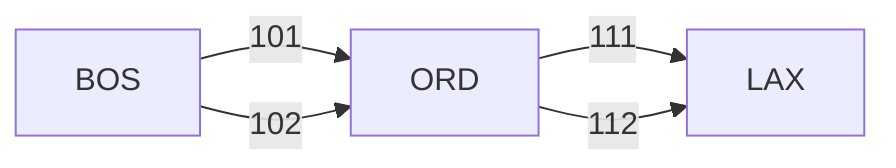

# Tutorials

This section includes some tutorials to demonstrate some of the capabilities of
PassengerSim.  These examples are built upon a very simple three market network
with two airlines.  Each airline offers a pair of flights from BOS to ORD, and
another pair from ORD to LAX.  Passenger demands are constructed for each single-leg
market, as well as for the connecting market BOS-LAX.

## 3MKT AL1

## 3MKT AL2

